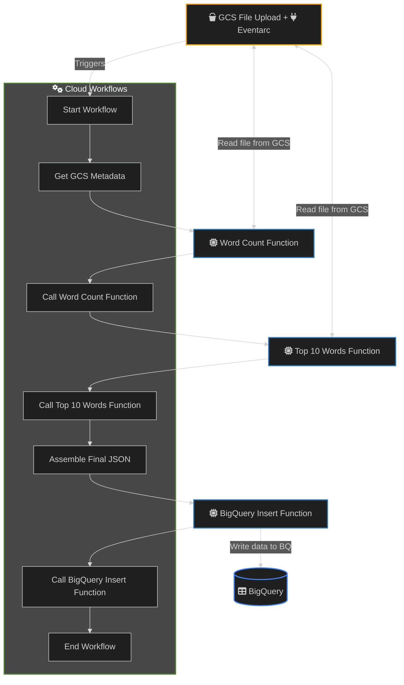

# GCP File Processing Workflow

This repository contains the necessary code and configuration to set up an automated file processing pipeline on Google Cloud Platform (GCP). The pipeline is triggered when a file is uploaded to a Google Cloud Storage (GCS) bucket, processes the file to extract metadata, count words, identify top frequent words, and finally stores all this information in a BigQuery table.

## Architecture Overview

The solution leverages the following GCP services:

* **Google Cloud Storage (GCS):** Stores the input files and triggers the workflow upon new uploads.
* **Cloud Functions:**
    * `word-count-function`: An HTTP-triggered function that counts the total words in a text file.
    * `top-10-words-function`: An HTTP-triggered function that identifies the top 10 most frequent words.
    * `insert-bigquery-function`: An HTTP-triggered function that inserts the processed data into BigQuery.
* **Cloud Workflows:** Orchestrates the sequence of calls to the Cloud Functions and handles the extraction of GCS object metadata.
* **BigQuery:** Stores the structured output data from the file processing.


## Repository Structure

```
gcp-file-processor/
├── cf-word-count/          # Cloud Function for total word counting
│   ├── main.py
│   └── requirements.txt
├── cf-top-10-words/        # Cloud Function for top 10 word frequency
│   ├── main.py
│   └── requirements.txt
├── cf-insert-bigquery/     # Cloud Function for BigQuery insertion
│   ├── main.py
│   └── requirements.txt
├── workflow.yaml           # Cloud Workflow definition
└── README.md               # This file
```

## Prerequisites

Before deploying, ensure you have:

* A Google Cloud Project with billing enabled.
* The `gcloud` CLI installed and authenticated.
* Enabled the following GCP APIs in your project:
    * Cloud Functions API
    * Cloud Workflows API
    * Cloud Storage API
    * BigQuery API
    * Eventarc API
    * Cloud Run API
    * Cloud Build API
    * Cloud Logging API

## Deployment Steps

Follow these steps to deploy your GCP file processing workflow. Replace placeholder values like
```
export PROJECT_ID=<YOUR_GCP_PROJECT_ID>
export BUCKET_NAME="${PROJECT_ID}-demos"
export REGION="us-central1"
PROJECT_NUMBER=$(gcloud projects describe ${PROJECT_ID} --format='value(projectNumber)')
echo ${PROJECT_ID} ${BUCKET_NAME} ${PROJECT_NUMBER}
```

### 1. Set your GCP Project ID and enable services
```
gcloud config set project ${PROJECT_ID}

# Enable the required services
gcloud services enable cloudfunctions.googleapis.com
gcloud services enable workflows.googleapis.com
gcloud services enable storage-api.googleapis.com
gcloud services enable bigquery.googleapis.com
gcloud services enable eventarc.googleapis.com
gcloud services enable run.googleapis.com
gcloud services enable cloudbuild.googleapis.com
gcloud services enable logging.googleapis.com

# Grant required roles to default compute service account to deploy cloud run functions
DEFAULT_COMPUTE_SA=${PROJECT_NUMBER}-compute@developer.gserviceaccount.com

gcloud projects add-iam-policy-binding ${PROJECT_ID} \
 --member="serviceAccount:${DEFAULT_COMPUTE_SA}" \
 --role="roles/cloudbuild.builds.builder" > /dev/null

gcloud projects add-iam-policy-binding ${PROJECT_ID} \
 --member="serviceAccount:${DEFAULT_COMPUTE_SA}" \
 --role="roles/logging.logWriter" > /dev/null
```

### 2. Create BigQuery Dataset and Table
First, set up your BigQuery table where the processed file information will be stored.
```
# Create a BigQuery Dataset
bq mk --dataset ${PROJECT_ID}:file_processing_dataset
```

You can execute this SQL in the BigQuery console or using the bq query command.
```
CREATE TABLE `${PROJECT_ID}.file_processing_dataset.file_processing_results` (
    filename       STRING,
    bucket         STRING,
    size_bytes     INTEGER,
    upload_date    TIMESTAMP,
    total_words    INTEGER,
    top_10_words   JSON
);

# or use the bq command
bq mk --table \
  --description "Table to store results from the file processing workflow" \
  "${PROJECT_ID}:file_processing_dataset.file_processing_results" \
  filename:STRING,bucket:STRING,size_bytes:INTEGER,upload_date:TIMESTAMP,total_words:INTEGER,top_10_words:JSON
```
### 3. Create a GCS Bucket
This is the bucket where files will be uploaded to trigger the workflow.
```
gsutil mb -l ${REGION} gs://${BUCKET_NAME}
```
The bucket must be in the same region as the workflow

### 4. Deploy Cloud Functions
Navigate into the gcp-workflow-sample directory on your local machine.

Each Cloud Function requires its own requirements.txt file as specified in the repository structure section above.

#### A. word-count-function:
Required IAM Permissions for word-count-function service account:
* Cloud Storage Object Viewer
* Cloud Functions Invoker
```
gcloud iam service-accounts create word-count-function-sa \
    --display-name="Cloud Function Word Count Service Account"

FUNCTION_SA="word-count-function-sa@${PROJECT_ID}.iam.gserviceaccount.com"

gcloud projects add-iam-policy-binding ${PROJECT_ID} \
    --member="serviceAccount:${FUNCTION_SA}" \
    --role="roles/cloudfunctions.invoker" > /dev/null

gcloud projects add-iam-policy-binding ${PROJECT_ID} \
    --member="serviceAccount:${FUNCTION_SA}" \
    --role="roles/storage.objectViewer" > /dev/null

gcloud functions deploy word-count-function \
    --runtime python310 \
    --entry-point count_words \
    --source cf-word-count/ \
    --trigger-http \
    --region ${REGION} \
    --service-account ${FUNCTION_SA} \
    --memory 256MB \
    --timeout 60s \
    --no-allow-unauthenticated # Only allow authenticated calls (from Workflow)
```

#### B. top-10-words-function:
Required IAM Permissions for top-10-words-function service account:
* Cloud Storage Object Viewer
* Cloud Functions Invoker
```
gcloud iam service-accounts create top-10-words-function-sa \
    --display-name="Cloud Function Top 10 Words Service Account"

FUNCTION_SA="top-10-words-function-sa@${PROJECT_ID}.iam.gserviceaccount.com"

gcloud projects add-iam-policy-binding ${PROJECT_ID} \
    --member="serviceAccount:${FUNCTION_SA}" \
    --role="roles/cloudfunctions.invoker" > /dev/null

gcloud projects add-iam-policy-binding ${PROJECT_ID} \
    --member="serviceAccount:${FUNCTION_SA}" \
    --role="roles/storage.objectViewer" > /dev/null

gcloud functions deploy top-10-words-function \
    --runtime python310 \
    --entry-point get_top_10_words \
    --source cf-top-10-words/ \
    --trigger-http \
    --region ${REGION} \
    --service-account ${FUNCTION_SA} \
    --memory 256MB \
    --timeout 60s \
    --no-allow-unauthenticated
```

#### C. insert-bigquery-function:
Required IAM Permissions for insert-bigquery-function service account:
* BigQuery Data Editor
* Cloud Functions Invoker
```
gcloud iam service-accounts create insert-bigquery-function-sa \
    --display-name="Cloud Function Insert BigQuery Service Account"

FUNCTION_SA="insert-bigquery-function-sa@${PROJECT_ID}.iam.gserviceaccount.com"

gcloud projects add-iam-policy-binding ${PROJECT_ID} \
    --member="serviceAccount:${FUNCTION_SA}" \
    --role="roles/cloudfunctions.invoker" > /dev/null

gcloud projects add-iam-policy-binding ${PROJECT_ID} \
    --member="serviceAccount:${FUNCTION_SA}" \
    --role="roles/bigquery.dataEditor" > /dev/null

gcloud functions deploy insert-bigquery-function \
    --runtime python310 \
    --entry-point insert_data_to_bigquery \
    --source cf-insert-bigquery/ \
    --trigger-http \
    --region ${REGION} \
    --service-account ${FUNCTION_SA} \
    --memory 256MB \
    --timeout 60s \
    --no-allow-unauthenticated
```

### 5. Deploy the Cloud Workflow
__Important__: Before deploying, update the Cloud Function URLs in workflow.yaml with the actual URLs of your deployed functions. These URLs will be in the format `https://${REGION}-${PROJECT_ID}.cloudfunctions.net/FUNCTION_NAME`.

Required IAM Permissions for file-processing-workflow-sa service account:
* Workflows Editor (for deployment)
* Workflows Invoker
* Cloud Functions Invoker (allows the workflow to call your HTTP Cloud Functions)
* Cloud Storage Object Viewer (allows the workflow to get GCS metadata directly)
```
gcloud iam service-accounts create file-processing-workflow-sa \
    --display-name="File Processing Workflow Service Account"

WORKFLOW_SA="file-processing-workflow-sa@${PROJECT_ID}.iam.gserviceaccount.com"

gcloud projects add-iam-policy-binding ${PROJECT_ID} \
    --member="serviceAccount:${WORKFLOW_SA}" \
    --role="roles/workflows.editor" > /dev/null

gcloud projects add-iam-policy-binding ${PROJECT_ID} \
    --member="serviceAccount:${WORKFLOW_SA}" \
    --role="roles/run.invoker" > /dev/null

gcloud projects add-iam-policy-binding ${PROJECT_ID} \
    --member="serviceAccount:${WORKFLOW_SA}" \
    --role="roles/cloudfunctions.invoker" > /dev/null

gcloud projects add-iam-policy-binding ${PROJECT_ID} \
    --member="serviceAccount:${WORKFLOW_SA}" \
    --role="roles/storage.objectViewer" > /dev/null

gcloud projects add-iam-policy-binding ${PROJECT_ID} \
  --member="serviceAccount:${WORKFLOW_SA}" \
  --role="roles/logging.logWriter" > /dev/null

gcloud workflows deploy file-processing-workflow \
    --source=workflow.yaml \
    --location=${REGION} \
    --service-account ${WORKFLOW_SA}

gcloud functions add-iam-policy-binding word-count-function \
   --region=us-central1 \
   --member="serviceAccount:${WORKFLOW_SA}" \
   --role="roles/run.invoker"
```

### 6. Create the Eventarc Trigger
Create the trigger that connects the GCS bucket to the workflow.
```
gcloud iam service-accounts create eventarc-workflow-sa \
    --display-name="Eventarc Trigger Workflow Service Account"

TRIGGER_SA="eventarc-workflow-sa@${PROJECT_ID}.iam.gserviceaccount.com"

gcloud projects add-iam-policy-binding ${PROJECT_ID} \
  --member="serviceAccount:${TRIGGER_SA}" \
  --role="roles/workflows.invoker" > /dev/null

gcloud projects add-iam-policy-binding ${PROJECT_ID} \
  --member="serviceAccount:${TRIGGER_SA}" \
  --role="roles/eventarc.eventReceiver" > /dev/null

# grant the Pub/Sub Publisher role to the Cloud Storage service agent:
STORAGE_AGENT="$(gcloud storage service-agent --project=${PROJECT_ID})"

gcloud projects add-iam-policy-binding ${PROJECT_ID} \
    --member="serviceAccount:${STORAGE_AGENT}" \
    --role="roles/pubsub.publisher" > /dev/null

# grant the Service Account Token Creator role to the pubsub service agent
PUBSUB_AGENT="service-${PROJECT_NUMBER}@gcp-sa-pubsub.iam.gserviceaccount.com"

gcloud projects add-iam-policy-binding ${PROJECT_ID} \
    --member="serviceAccount:${PUBSUB_AGENT}" \
    --role="roles/iam.serviceAccountTokenCreator" > /dev/null

# Create the Eventarc Trigger (triggered on file upload to bucket)
gcloud eventarc triggers create gcs-workflow-trigger \
    --location=us-central1 \
    --destination-workflow=file-processing-workflow \
    --destination-workflow-location=us-central1 \
    --event-filters="type=google.cloud.storage.object.v1.finalized" \
    --event-filters="bucket=${BUCKET_NAME}" \
    --service-account=${TRIGGER_SA}
```

### 7. Testing Your Workflow
Once all components are deployed, upload a text file (e.g., my_document.txt) to your YOUR_GCS_BUCKET_NAME GCS bucket.

```
echo "This is a sample document for testing the workflow. This document has multiple words for word counting. Sample words." > my_document.txt
gsutil cp my_document.txt gs://${BUCKET_NAME}/my_document.txt
```

You can monitor the workflow executions in the Google Cloud Console:

__Workflow Executions__: Navigate to Cloud Workflows > file-processing-workflow > Executions to see the status and details of your workflow runs.

__BigQuery Table__: Check your $PROJECT_ID.file_processing_dataset.file_processing_results table in BigQuery to verify that new rows are inserted.

## Troubleshooting Tips
* Check Cloud Function Logs: If a workflow execution fails, check the logs for the specific Cloud Function that caused the failure.
* Check Workflow Execution Details: The workflow execution details in the Cloud Console will show which step failed and often provide error messages.
* IAM Permissions: The most common issue is incorrect IAM permissions. Double-check that all service accounts have the necessary roles assigned as specified above.
* Cloud Function URLs in Workflow: Ensure the URLs in workflow.yaml exactly match your deployed Cloud Function URLs.