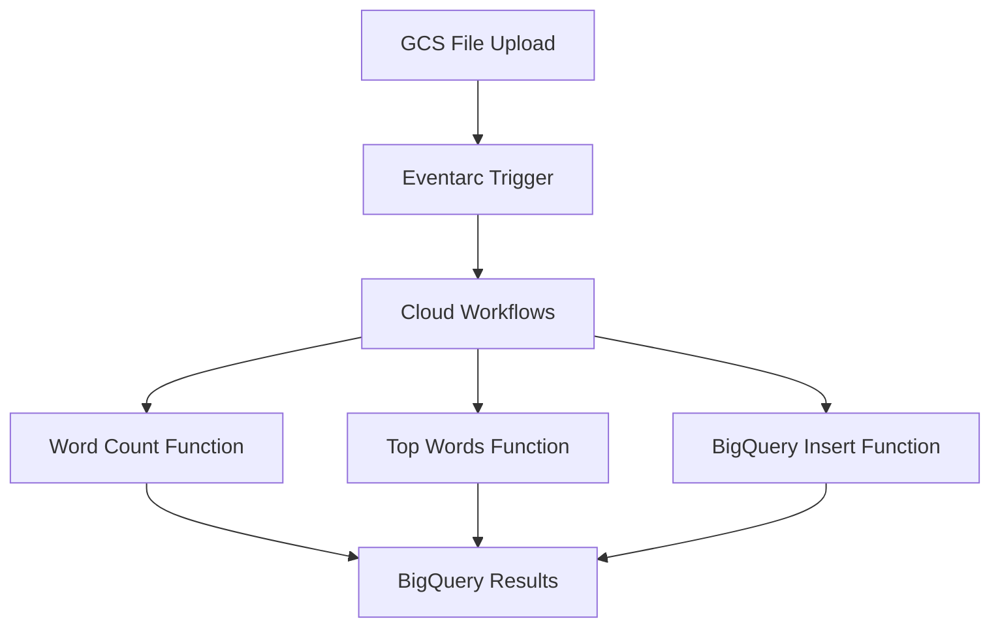
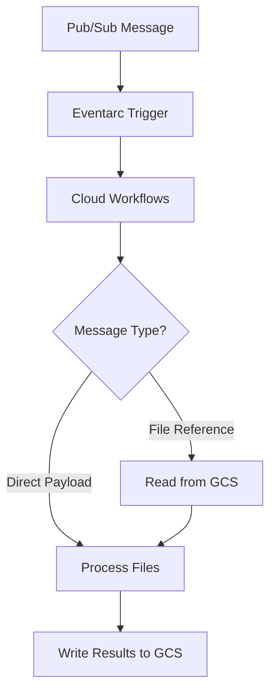

# Building Event-Driven Serverless Architectures with Google Cloud Workflows: Two Practical Examples

*Learn how to orchestrate complex cloud processes with real-world file processing and message-driven workflows*

## Introduction

In today's cloud-native world, building resilient, scalable, and cost-effective applications often means embracing serverless architectures. Google Cloud Workflows provides a powerful orchestration service that lets you connect and coordinate various cloud services in a visual, declarative way. Whether you're processing uploaded files, responding to messages, or coordinating complex business logic across multiple services, Workflows can simplify your architecture while making it more reliable.

In this article, we'll explore two practical workflow patterns through hands-on examples: a **file processing pipeline** and a **message-driven workflow**. By the end, you'll understand when to use each pattern and have working code you can deploy in your own GCP environment.

## What Are Google Cloud Workflows?

Google Cloud Workflows is a serverless orchestration service that allows you to connect cloud services, APIs, and on-premises systems in a reliable, fault-tolerant manner. Think of it as the conductor of your cloud orchestra — it doesn't perform the heavy lifting itself, but coordinates when and how each service plays its part.

### Key Benefits:

- **Serverless**: No infrastructure to manage, pay only for what you use
- **Visual**: Define workflows in YAML with clear step-by-step logic
- **Reliable**: Built-in error handling, retries, and state management
- **Integrated**: Native connectivity to Google Cloud services
- **Event-driven**: Trigger workflows from various sources like storage uploads, pub/sub messages, or HTTP requests

## Architecture Patterns Overview

We'll explore two fundamental patterns that solve different use cases:

### Pattern 1: File Processing Workflow
```
GCS File Upload → Eventarc → Cloud Workflows → Cloud Functions → BigQuery
```
**Best for**: Processing files uploaded to storage, complex multi-step processing, storing structured results in databases

### Pattern 2: Pub/Sub Message Workflow  
```
Pub/Sub Message → Eventarc → Cloud Workflows → GCS Read/Write
```
**Best for**: Processing messages from multiple sources, lightweight processing, pure workflow orchestration

Let's dive into each pattern with complete, deployable examples.

## Pattern 1: File Processing Workflow

Our first example demonstrates a sophisticated file processing pipeline that automatically analyzes text files uploaded to Google Cloud Storage. When a file is uploaded, it triggers a workflow that counts words, identifies the most frequent terms, and stores the results in BigQuery.

### Architecture Deep Dive



This workflow showcases several powerful concepts:

1. **Event-driven triggers**: File uploads automatically start processing
2. **Service orchestration**: Coordinates multiple Cloud Functions
3. **Data persistence**: Stores structured results in BigQuery
4. **Error handling**: Built-in retry logic for failed operations

### Workflow Definition

Here's the core workflow definition (`workflow.yaml`):

```yaml
main:
  params: [event]
  steps:
  - extract_event_data:
      assign:
      - bucket_name: ${event.data.bucket}
      - file_name: ${event.data.name}
      - project_id: ${sys.get_env("GOOGLE_CLOUD_PROJECT_ID")}

  - get_gcs_object_metadata:
      call: googleapis.storage.v1.objects.get
      args:
        bucket: ${bucket_name}
        object: ${file_name}
      result: gcs_metadata

  - call_word_count_function:
      call: http.post
      args:
        url: ${"https://" + region + "-" + project_id + ".cloudfunctions.net/word-count-function"}
        body:
          bucket_name: ${bucket_name}
          file_path: ${file_name}
        auth:
          type: OIDC
      result: word_count_response

  - call_top_10_words_function:
      call: http.post
      args:
        url: ${"https://" + region + "-" + project_id + ".cloudfunctions.net/top-10-words-function"}
        body:
          bucket_name: ${bucket_name}
          file_path: ${file_name}
        auth:
          type: OIDC
      result: top_10_words_response

  - call_bigquery_insert_function:
      call: http.post
      args:
        url: ${"https://" + region + "-" + project_id + ".cloudfunctions.net/insert-bigquery-function"}
        body:
          filename: ${file_name}
          bucket: ${bucket_name}
          size_bytes: ${gcs_metadata.size}
          upload_date: ${gcs_metadata.updated}
          total_words: ${word_count_response.body.total_words}
          top_10_words: ${top_10_words_response.body.top_10_words}
        auth:
          type: OIDC
```

### Cloud Functions

The workflow coordinates three specialized Cloud Functions:

**Word Count Function** (`cf-word-count/main.py`):
```python
def count_words(request):
    request_json = request.get_json()
    bucket_name = request_json.get('bucket_name')
    file_path = request_json.get('file_path')
    
    bucket = storage_client.bucket(bucket_name)
    blob = bucket.blob(file_path)
    contents = blob.download_as_text()
    
    words = contents.split()
    return {'total_words': len(words)}
```

**Top Words Function** (`cf-top-10-words/main.py`):
```python
def get_top_10_words(request):
    # Download and process file
    words = re.findall(r'\b\w+\b', contents.lower())
    word_counts = Counter(words)
    top_10 = word_counts.most_common(10)
    
    return {'top_10_words': [{'word': word, 'count': count} for word, count in top_10]}
```

### When to Use This Pattern

This file processing pattern is ideal when you need to:
- Automatically process files as they're uploaded
- Coordinate multiple processing steps with different compute requirements
- Store structured results for later analysis
- Handle complex error scenarios with retries and rollbacks

## Pattern 2: Pub/Sub Message Workflow

Our second example demonstrates a lightweight, message-driven workflow that processes JSON payloads to analyze file sizes. This pattern showcases pure workflow orchestration without Cloud Functions, making it more cost-effective for simple processing tasks.

### Architecture Deep Dive



This workflow demonstrates:

1. **Message-driven processing**: Responds to Pub/Sub messages
2. **Conditional logic**: Handles both direct payloads and file references
3. **Pure orchestration**: No Cloud Functions needed
4. **Cost optimization**: Uses only managed services

### Workflow Definition

Here's the core workflow (`pubsub.yaml`):

```yaml
main:
  params: [event]
  steps:
  - decode_pubsub_message:
      assign:
      - message_data: ${base64.decode(event.data.message.data)}
      - payload: ${json.decode(message_data)}

  - check_payload_type:
      switch:
      - condition: ${"bucket" in payload}
        # Indirect method: payload points to a file in GCS
        next: read_file_from_gcs
      - condition: ${"files" in payload}
        # Direct method: payload contains the data directly
        assign:
        - files_data: ${payload}
        next: prepare_output_variables

  - read_file_from_gcs:
      call: googleapis.storage.v1.objects.get
      args:
        bucket: ${payload.bucket}
        object: ${payload.file}
        alt: media
      result: file_content
      next: parse_file_content

  - process_files:
      for:
        value: file_item
        in: ${files_data.files}
        steps:
        - get_file_size:
            call: googleapis.storage.v1.objects.get
            args:
              bucket: ${file_item.bucket_name}
              object: ${file_item.file_path}
            result: file_metadata
        - add_to_results:
            assign:
            - results[file_item.file_path]: ${file_metadata.size}

  - write_results_to_gcs:
      call: googleapis.storage.v1.objects.insert
      args:
        bucket: ${output_bucket}
        body:
          name: ${output_filename}
        media:
          data: ${base64.encode(json.encode(final_output))}
```

### Message Processing Flexibility

This workflow handles two message types:

**Direct Payload**: The message contains the complete data
```json
{
  "files": [
    {"bucket_name": "my-bucket", "file_path": "document1.pdf"},
    {"bucket_name": "my-bucket", "file_path": "document2.pdf"}
  ]
}
```

**Indirect Payload**: The message points to a file containing the data
```json
{
  "bucket": "my-input-bucket",
  "file": "batch-job-config.json"
}
```

### When to Use This Pattern

This message-driven pattern is perfect for:
- Processing events from multiple sources
- Lightweight data transformation tasks
- Batch processing jobs triggered by schedules or external systems
- Cost-sensitive applications (no Cloud Functions = lower costs)

## Deployment Guide

Both workflows are ready to deploy with complete setup instructions. Here's what you'll need:

### Prerequisites
- Google Cloud Project with billing enabled
- `gcloud` CLI installed and authenticated
- Required APIs enabled (varies by workflow)

### Quick Start

1. **Clone the repository**:
```bash
git clone https://github.com/lavjain/gcp-workflows-sample.git
cd gcp-workflows-sample
```

2. **Choose your workflow**:
- File Processing: `cd file-processing-workflow`
- Pub/Sub Processing: `cd pubsub-workflow`

3. **Follow the README**: Each workflow has complete deployment instructions with:
   - Environment variable setup
   - Service enablement
   - IAM configuration
   - Testing examples

### Cost Considerations

**File Processing Workflow**:
- Cloud Functions: Pay per invocation
- BigQuery: Pay per query and storage
- Workflows: Pay per step execution

**Pub/Sub Workflow**:
- Pub/Sub: Pay per message
- Cloud Storage: Pay per operation and storage
- Workflows: Pay per step execution

The Pub/Sub workflow is generally more cost-effective for simple processing tasks.

## Testing Your Workflows

### File Processing Workflow Test
```bash
# Upload a test file
echo "This is a sample document for testing." > test.txt
gsutil cp test.txt gs://${BUCKET_NAME}/test.txt
```

### Pub/Sub Workflow Test
```bash
# Send a direct payload message
PAYLOAD='{"files": [{"bucket_name": "my-bucket", "file_path": "sample.pdf"}]}'
gcloud pubsub topics publish file-processing-topic --message "$PAYLOAD"
```

## Best Practices and Lessons Learned

Through building these workflows, several best practices emerged:

### 1. Design for Observability
- Use descriptive step names
- Log important state transitions
- Include error context in failure messages

### 2. Handle Errors Gracefully
```yaml
- risky_operation:
    try:
      call: some_external_api
    except:
      as: e
      steps:
      - log_error:
          call: sys.log
          args:
            text: ${"Error occurred: " + e.message}
      - handle_gracefully:
          # Implement fallback logic
```

### 3. Use Environment Variables
Dynamic function URLs using project ID and region make workflows portable across environments.

### 4. Secure Service-to-Service Communication
Both workflows use OIDC authentication for secure communication between services.

## Monitoring and Debugging

Google Cloud provides excellent tools for workflow monitoring:

- **Workflows Console**: Visual execution history and step-by-step debugging
- **Cloud Logging**: Centralized logs from all services
- **Cloud Monitoring**: Custom metrics and alerting
- **Error Reporting**: Automatic error aggregation and analysis

## What's Next?

These examples provide a solid foundation for building production workflows. Consider these extensions:

1. **Add retry policies** for handling transient failures
2. **Implement circuit breakers** for external API calls
3. **Add parallel processing** for batch operations
4. **Include human approval steps** for sensitive operations
5. **Integrate with Cloud Tasks** for long-running operations

## Conclusion

Google Cloud Workflows offers a powerful way to build serverless, event-driven architectures. The two patterns we explored — file processing and message-driven workflows — demonstrate different approaches to common integration challenges.

The **file processing workflow** shows how to coordinate multiple services for complex processing tasks, while the **pub/sub workflow** demonstrates lightweight orchestration for simple but flexible message processing.

Both patterns are production-ready and include complete deployment instructions. Whether you're building data pipelines, integrating microservices, or automating business processes, these examples provide practical starting points for your own workflow implementations.

The complete source code and deployment instructions are available in the [GitHub repository](https://github.com/lavjain/gcp-workflows-sample). Try deploying one of the workflows in your own GCP environment and see how easy it is to build robust, serverless orchestration with Google Cloud Workflows.

---

*Have questions about implementing these workflows in your environment? Leave a comment below or reach out on Twitter. I'd love to hear about the workflow patterns you're building!*

## Additional Resources

- [Google Cloud Workflows Documentation](https://cloud.google.com/workflows/docs)
- [Workflow Syntax Reference](https://cloud.google.com/workflows/docs/reference/syntax)
- [Eventarc Documentation](https://cloud.google.com/eventarc/docs)
- [Complete GitHub Repository](https://github.com/lavjain/gcp-workflows-sample)