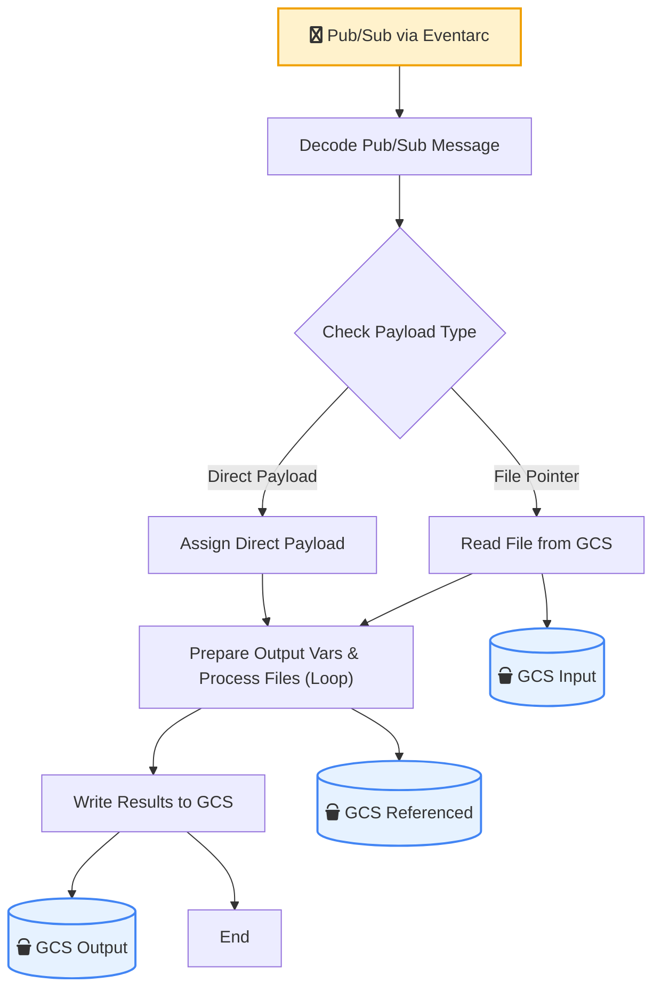

# GCP Pub/Sub Workflow

This directory contains a flexible, automated file processing pipeline on Google Cloud Platform (GCP) that is triggered when a Pub/Sub message is published. The workflow can be triggered in two ways:

**Indirectly**: The Pub/Sub message is a JSON object pointing to a file in a GCS bucket that contains the actual payload.

**Directly**: The Pub/Sub message is the full JSON payload itself.

The workflow processes the payload to determine the size of various files listed within it and stores the results in a new JSON file in a GCS bucket.

## Architecture Overview

The solution leverages the following GCP services:

**Google Cloud Storage (GCS)**: Stores the input JSON files (for the indirect method) and the final output results.

**Pub/Sub**: A message on a topic triggers the workflow. The message body can be either a direct JSON payload or a JSON object pointing to a file in GCS.

**Cloud Workflows**: Orchestrates the process of reading and parsing the input, getting the size of each file referenced in the content, and writing the results to an output file.

**Eventarc**: Connects the Pub/Sub topic to the Cloud Workflow, triggering an execution for each new message.



## Directory Structure

```
pubsub-workflow/
├── pubsub.yaml             # Cloud Workflow definition
├── sample-files/           # Sample files for testing
├── payload.txt             # Example payload
└── README.md               # This file
```

## Prerequisites

Before deploying, ensure you have:

* A Google Cloud Project with billing enabled.
* The `gcloud` CLI installed and authenticated.
* Enabled the following GCP APIs in your project:
    * Pub/Sub API
    * Cloud Workflows API
    * Cloud Storage API
    * Eventarc API

## Deployment Steps

### 1. Set Environment Variables
First, set the required environment variables. Replace `<YOUR_GCP_PROJECT_ID>` with your actual project ID:
```bash
export PROJECT_ID=<YOUR_GCP_PROJECT_ID>
export REGION="us-central1"
export INPUT_BUCKET="${PROJECT_ID}-input-files"
export DEFAULT_RESULTS_BUCKET="${PROJECT_ID}-results"
echo "Project: ${PROJECT_ID}, Region: ${REGION}"
```

### 2. Enable services
```bash
gcloud config set project ${PROJECT_ID}

# Enable the required services
gcloud services enable pubsub.googleapis.com
gcloud services enable workflows.googleapis.com
gcloud services enable storage-api.googleapis.com
gcloud services enable eventarc.googleapis.com

PROJECT_NUMBER=$(gcloud projects describe ${PROJECT_ID} --format='value(projectNumber)')
```

### 3. Create GCS Buckets
You'll need buckets for input files (for the indirect method) and a default bucket for results (for the direct method).
```
# Create the input bucket for file-based payloads
gsutil mb -l ${REGION} gs://${INPUT_BUCKET}

# Create the default results bucket for direct payloads
gsutil mb -l ${REGION} gs://${DEFAULT_RESULTS_BUCKET}
```

### 4. Create Pub/Sub Topic
This topic will trigger the Cloud Workflow.
```
gcloud pubsub topics create file-processing-topic --project $PROJECT_ID
```

### 5. Deploy the Cloud Workflow

Create a service account for the workflow and grant it the necessary permissions. The workflow needs to view and create objects in any bucket you plan to use.

Required IAM Permissions for file-processing-workflow-sa:

* Workflows Invoker
* Storage Object Viewer (on any input buckets)
* Storage Object Creator (on any output buckets)
```
gcloud iam service-accounts create file-processing-workflow-sa \
    --display-name="File Processing Workflow Service Account"

WORKFLOW_SA="file-processing-workflow-sa@${PROJECT_ID}.iam.gserviceaccount.com"

# Allow the service account to be invoked by Eventarc
gcloud projects add-iam-policy-binding ${PROJECT_ID} \
    --member="serviceAccount:${WORKFLOW_SA}" \
    --role="roles/workflows.invoker" > /dev/null

# Grant permissions on the buckets (repeat if you use other buckets)
gsutil iam ch serviceAccount:${WORKFLOW_SA}:objectViewer gs://${INPUT_BUCKET}
gsutil iam ch serviceAccount:${WORKFLOW_SA}:objectCreator gs://${INPUT_BUCKET}
gsutil iam ch serviceAccount:${WORKFLOW_SA}:objectCreator gs://${DEFAULT_RESULTS_BUCKET}
```

Now, deploy the workflow using your pubsub.yaml file.
```bash
cd pubsub-workflow
gcloud workflows deploy file-processing-pubsub-workflow \
    --source=pubsub.yaml \
    --location=${REGION} \
    --service-account=${WORKFLOW_SA}
```

### 6. Create the Eventarc Trigger
Create an Eventarc trigger to connect the Pub/Sub topic to the workflow.
```
gcloud iam service-accounts create eventarc-trigger-sa \
    --display-name="Eventarc Trigger Service Account"

TRIGGER_SA="eventarc-trigger-sa@${PROJECT_ID}.iam.gserviceaccount.com"

gcloud projects add-iam-policy-binding ${PROJECT_ID} \
    --member="serviceAccount:${TRIGGER_SA}" \
    --role="roles/workflows.invoker" > /dev/null

gcloud projects add-iam-policy-binding ${PROJECT_ID} \
    --member="serviceAccount:${TRIGGER_SA}" \
    --role="roles/eventarc.eventReceiver" > /dev/null

PUBSUB_AGENT="service-${PROJECT_NUMBER}@gcp-sa-pubsub.iam.gserviceaccount.com"

gcloud projects add-iam-policy-binding ${PROJECT_ID} \
    --member="serviceAccount:${PUBSUB_AGENT}" \
    --role="roles/iam.serviceAccountTokenCreator" > /dev/null

gcloud eventarc triggers create pubsub-workflow-trigger \
    --location=${REGION} \
    --destination-workflow=file-processing-pubsub-workflow \
    --destination-workflow-location=${REGION} \
    --event-filters="type=google.cloud.pubsub.topic.v1.messagePublished" \
    --transport-topic=projects/${PROJECT_ID}/topics/file-processing-topic \
    --service-account=${TRIGGER_SA}
```

### 7. Upload Sample Files (Optional)
For testing purposes, you can upload the provided sample PDF files to the input bucket.

```bash
# Upload all sample PDF files to the input bucket
cd pubsub-workflow
gsutil cp sample-files/*.pdf gs://${INPUT_BUCKET}/

# The workflow service account already has access to INPUT_BUCKET from step 5
```

### 8. Testing Your Workflow
You can now test the workflow using either of the two methods.

**Method 1**: Indirect Payload (via Filename)
In this method, you upload a JSON file to GCS and then send a Pub/Sub message pointing to that file. The output will be written to the same bucket the input file was read from.

Create a sample input file named `sample-payload.json` with all 5 PDF files:
```json
{
  "files": [
    {
      "bucket_name": "${INPUT_BUCKET}",
      "file_path": "Classic Chocolate Chip Cookies.pdf"
    },
    {
      "bucket_name": "${INPUT_BUCKET}",
      "file_path": "Creamy Tomato Soup.pdf"
    },
    {
      "bucket_name": "${INPUT_BUCKET}",
      "file_path": "Fluffy Scrambled Eggs.pdf"
    },
    {
      "bucket_name": "${INPUT_BUCKET}",
      "file_path": "Quick Chicken Stir-Fry.pdf"
    },
    {
      "bucket_name": "${INPUT_BUCKET}",
      "file_path": "Simple Spaghetti Carbonara.pdf"
    }
  ]
}
```

Note: Replace `${INPUT_BUCKET}` with your actual bucket name when creating the file, or use this command:
```bash
# Create the payload file with the correct bucket name
cat > sample-payload.json << EOF
{
  "files": [
    {
      "bucket_name": "${INPUT_BUCKET}",
      "file_path": "Classic Chocolate Chip Cookies.pdf"
    },
    {
      "bucket_name": "${INPUT_BUCKET}",
      "file_path": "Creamy Tomato Soup.pdf"
    },
    {
      "bucket_name": "${INPUT_BUCKET}",
      "file_path": "Fluffy Scrambled Eggs.pdf"
    },
    {
      "bucket_name": "${INPUT_BUCKET}",
      "file_path": "Quick Chicken Stir-Fry.pdf"
    },
    {
      "bucket_name": "${INPUT_BUCKET}",
      "file_path": "Simple Spaghetti Carbonara.pdf"
    }
  ]
}
EOF
```

**Upload the file** to your input GCS bucket.
```
gsutil cp sample-payload.json gs://${INPUT_BUCKET}/sample-payload.json
```

**Publish a JSON message** to your Pub/Sub topic pointing to the file.
```
PAYLOAD='{"bucket": "'"${INPUT_BUCKET}"'", "file": "sample-payload.json"}'

gcloud pubsub topics publish file-processing-topic --message "$PAYLOAD"
```

**Method 2**: Direct Payload
In this method, you send the full JSON payload directly in the Pub/Sub message. The output will be written to your default results bucket `${PROJECT_ID}-results`.

**Option 2a**: Single file test
```bash
PAYLOAD='{"files": [{"bucket_name": "'${INPUT_BUCKET}'", "file_path": "Fluffy Scrambled Eggs.pdf"}]}'
gcloud pubsub topics publish file-processing-topic --message "$PAYLOAD"
```

**Option 2b**: All 5 files at once
```bash
PAYLOAD='{"files": [{"bucket_name": "'${INPUT_BUCKET}'", "file_path": "Classic Chocolate Chip Cookies.pdf"}, {"bucket_name": "'${INPUT_BUCKET}'", "file_path": "Creamy Tomato Soup.pdf"}, {"bucket_name": "'${INPUT_BUCKET}'", "file_path": "Fluffy Scrambled Eggs.pdf"}, {"bucket_name": "'${INPUT_BUCKET}'", "file_path": "Quick Chicken Stir-Fry.pdf"}, {"bucket_name": "'${INPUT_BUCKET}'", "file_path": "Simple Spaghetti Carbonara.pdf"}]}'
gcloud pubsub topics publish file-processing-topic --message "$PAYLOAD"
```
You can monitor the workflow executions in the Google Cloud Console:

__Workflow Executions__: Navigate to Cloud Workflows > file-processing-pubsub-workflow > Executions to see the status and details of your workflow runs.

## Troubleshooting Tips
* Check Workflow Execution Details: The workflow execution details in the Cloud Console will show which step failed and often provide error messages.
* IAM Permissions: The most common issue is incorrect IAM permissions. Double-check that all service accounts have the necessary roles assigned as specified above.
* Pub/Sub Message Format: Ensure your Pub/Sub messages follow the expected JSON format for either direct or indirect payloads.